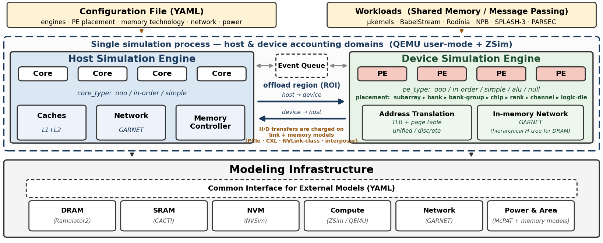

# PIMID: Processing-In-Memory Infrastructure for Design-space Exploration


[](LICENSE)
[](https://isocpp.org/)
[]()
[](https://arxiv.org/abs/2607.24196)

PIMID is a cycle-accurate simulator for Processing-in-Memory (PIM)
architectures. Workloads execute under QEMU user-mode emulation; a TCG plugin
drives ZSim microarchitectural models backed by Ramulator2, CACTI, NVSim,
McPAT, and Garnet for timing, power, and area.

<br clear="all" />



## Features

- **11 memory technologies** — 7 DRAM (DDR3/4/5, LPDDR5, GDDR6, HBM2, HBM3),
  SRAM, 3 NVM (STT-MRAM, PCM, ReRAM) → [docs/memory.md](docs/memory.md)
- **5 PE core models** — `alu_core`, `simple_core`, `in_order_core`,
  `ooo_core`, `null_core` → [docs/cores.md](docs/cores.md)
- **2 network models** — `detailed` (cycle-accurate Garnet over sparse
  placement-driven DRAM trees; ONE logical network across OpenMP threads AND
  MPI ranks; the default) and `analytical` (closed-form hop + M/D/1 + MLP)
  over 8 topologies → [docs/network.md](docs/network.md)
- **Per-technology PE placement** — subarray → bank → bank-group →
  rank/channel → logic-die ladders (tech-specific; only HBM reaches the logic
  die) → [docs/memory.md](docs/memory.md)
- **Host-device co-simulation** — offload over interposer / CXL / PCIe /
  NVLink-class links → [docs/cosim.md](docs/cosim.md)
- **4 simulation methods** — `exec`, `trace-gen`, `trace`, `synthetic`
  → [docs/architecture.md](docs/architecture.md)
- **48 benchmarks** across 7 suites; any of them runs in co-sim (no
  co-sim-specific workloads) → [docs/benchmarks.md](docs/benchmarks.md)
- **Power/area** via McPAT → [docs/power.md](docs/power.md)

## Project layout

```
pimid/
├── src/  include/        simulator core (ZSim integration, models, config)
├── external/             bundled backends: zsim, qemu, ramulator, cacti,
│                         nvsim, mcpat, garnet
├── benchmarks/           48-benchmark suite + cosim/ + host/ kernels
├── examples/             runnable example configs (techs, cores, topologies,
│                         placements, cosim) + integration/ extension demo
├── docs/                 full documentation (see below)
└── CMakeLists.txt  LICENSE  README.md
```

## Build

```bash
# dependencies (Ubuntu/Debian): see docs/build.md
mkdir -p build && cd build && cmake .. && make -j$(nproc)
make -C ../benchmarks all
```

QEMU with TCG plugins is required for execution-driven mode — build it once
into `external/qemu/build/` ([docs/build.md](docs/build.md)).
Or skip building entirely:

```bash
docker pull ghcr.io/isaacyhe/pimid:latest
```

## Run

```bash
# cycle-accurate run of an example config
./build/pimid --method exec --config examples/tech_HBM3.yaml --no-power

# synthetic NoC traffic, no workload needed
./build/pimid --method synthetic --config examples/topo_MESH_2D.yaml

# bit-stable timing (disable ASLR)
setarch -R ./build/pimid --method exec --config examples/tech_DDR4.yaml
```

A minimal config:

```yaml
scope: device
workload: { binary: benchmarks/pim_kernels/stream_triad/stream_triad,
            args: ["--size", "8192"] }
pim:
  pe: { type: alu_core, count: 8, frequency_mhz: 1000 }
  placement: { level: BANK }
memory: { technology: HBM3 }
noc: { model: detailed }      # default; 'analytical' for fast sweeps
```

## Documentation

| | |
|---|---|
| [docs/architecture.md](docs/architecture.md) | engine, methods, scopes, two-Garnet hierarchy |
| [docs/memory.md](docs/memory.md) | technologies, backends, placement, characterization cache |
| [docs/network.md](docs/network.md) | the two NoC models, topologies, DRAM trees, synthetic traffic |
| [docs/cores.md](docs/cores.md) | PE core models, ALU scaling, MLP |
| [docs/cosim.md](docs/cosim.md) | host-device offload, link types, MPI semantics |
| [docs/benchmarks.md](docs/benchmarks.md) | suites, data-model variants, building, running |
| [docs/examples.md](docs/examples.md) | the example config set |
| [docs/power.md](docs/power.md) | McPAT power/area |
| [docs/build.md](docs/build.md) | build details, HPC notes, Docker, reproducibility |
| [docs/yaml_reference.md](docs/yaml_reference.md) | every configuration key |
| [docs/dram_specs.md](docs/dram_specs.md) | per-technology JEDEC mapping |
| [docs/memory_spec_structs.md](docs/memory_spec_structs.md) | C++ architecture-spec structs |
| [docs/cache_warehouse.md](docs/cache_warehouse.md) | characterization cache internals |
| [docs/external.md](docs/external.md) | vendored external simulators |
| [docs/sources.md](docs/sources.md) | every external number's provenance (papers, JEDEC standards, datasheets) |
| [docs/external_models.md](docs/external_models.md) | plugging in your own models |

## Citation

If you use PIMID in your research, please cite our paper:

> Yuan He, Masaaki Kondo, Galen M. Shipman, Jered B. Dominguez-Trujillo,
> Shigeki Tomishima, and Kazi Asifuzzaman. *PIMID: A Full-System Simulator with
> Intricacy and Diversity for Processing-in-Memory*. arXiv:2607.24196 [cs.AR],
> 2026. <https://arxiv.org/abs/2607.24196>

```bibtex
@misc{pimid2026,
  title         = {{PIMID}: A Full-System Simulator with Intricacy and Diversity
                   for Processing-in-Memory},
  author        = {He, Yuan and Kondo, Masaaki and Shipman, Galen M. and
                   Dominguez-Trujillo, Jered B. and Tomishima, Shigeki and
                   Asifuzzaman, Kazi},
  year          = {2026},
  eprint        = {2607.24196},
  archivePrefix = {arXiv},
  primaryClass  = {cs.AR},
  url           = {https://arxiv.org/abs/2607.24196}
}
```

### Upstream tools

PIMID composes several established simulators, each vendored under
[`external/`](external/). If your work depends on a specific component, please
also cite its paper:

| Component | Role in PIMID | Paper | Upstream |
|---|---|---|---|
| Ramulator 2.0 | DRAM timing and energy | [Luo et al., IEEE CAL 2024](https://doi.org/10.1109/LCA.2023.3333759) | [CMU-SAFARI/ramulator2](https://github.com/CMU-SAFARI/ramulator2) |
| CACTI 7 | SRAM arrays, cache timing/area | [Balasubramonian et al., ACM TACO 2017](https://doi.org/10.1145/3085572) | [HewlettPackard/cacti](https://github.com/HewlettPackard/cacti) |
| CACTI-IO | off-chip DRAM interface: termination, PHY, IO area | [Jouppi et al., ICCAD 2012](https://doi.org/10.1145/2429384.2429504) | ships inside CACTI 7 (`external/cacti/extio*`) |
| CACTI-P | power gating / sleep-transistor and retention (Vcc_min) model | [Li et al., ICCAD 2011](https://doi.org/10.1109/ICCAD.2011.6105405) | grafted into `external/cacti` (the 6.5-P fields McPAT consumes) |
| CACTI-D | DRAM cell/device technology (`comm-dram`, `lp-dram`) and DRAM arrays | [Thoziyoor et al., ISCA 2008](https://doi.org/10.1109/ISCA.2008.16) | ships inside CACTI 7 (`external/cacti`, dram cell/device paths) |
| CACTI-3DD | 3D-stacked DRAM + TSV model — present and compiled, **not yet invoked** (see [docs/sources.md](docs/sources.md)) | [Chen et al., DATE 2012](https://doi.org/10.1109/DATE.2012.6176428) | ships inside CACTI 7 (`external/cacti/TSV.cc`) |
| NVSim | STT-MRAM, PCM, ReRAM arrays | [Dong et al., IEEE TCAD 2012](https://doi.org/10.1109/TCAD.2012.2185930) | [SEAL-UCSB/NVSim](https://github.com/SEAL-UCSB/NVSim) |
| Garnet | cycle-accurate in-memory network | [Agarwal et al., ISPASS 2009](https://doi.org/10.1109/ISPASS.2009.4919636) | [gem5/gem5](https://github.com/gem5/gem5) |
| McPAT | power and area | [Li et al., MICRO 2009](https://doi.org/10.1145/1669112.1669172) | [HewlettPackard/mcpat](https://github.com/HewlettPackard/mcpat) |
| ZSim | microarchitectural core models | [Sanchez and Kozyrakis, ISCA 2013](https://doi.org/10.1145/2485922.2485963) | [s5z/zsim](https://github.com/s5z/zsim) |
| QEMU | user-mode execution and TCG plugins | [Bellard, USENIX ATC 2005](https://www.usenix.org/legacy/publications/library/proceedings/usenix05/tech/freenix/bellard.html) | [qemu-project/qemu](https://gitlab.com/qemu-project/qemu) |

**These are not stock copies.** Each carries our defect fixes, added models, and
calibration against vendor and JEDEC source data, so PIMID's numbers need not
match a stock build of the same tool. See
[docs/changelog.md](docs/changelog.md) and
[docs/external.md](docs/external.md) for what changed.

## License

GPL-2.0. See [LICENSE](LICENSE).
